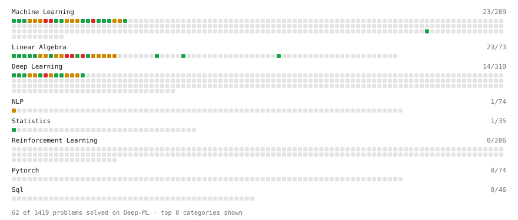

# Deep-ML

My machine learning practice from [Deep-ML](https://www.deep-ml.com). Every solution here was written by hand.

**35** solved · 35 problems · 0 labs · 0 math

[**Browse the interactive portfolio**](https://tanghaibao.github.io/deep-ml/) to replay this filling in over time.

## Problems

| | Difficulty | Solved | |
| --- | --- | --- | --- |
| [Batch Iterator for Dataset](https://www.deep-ml.com/problems/30) | easy | 2024-08-03 | [solution](problems/0030-batch-iterator-for-dataset) |
| [Calculate 2x2 Matrix Inverse](https://www.deep-ml.com/problems/8) | easy | 2024-08-03 | [solution](problems/0008-calculate-2x2-matrix-inverse) |
| [Calculate Accuracy Score](https://www.deep-ml.com/problems/36) | easy | 2024-08-03 | [solution](problems/0036-calculate-accuracy-score) |
| [Calculate Covariance Matrix](https://www.deep-ml.com/problems/10) | easy | 2024-08-03 | [solution](problems/0010-calculate-covariance-matrix) |
| [Calculate Mean by Row or Column](https://www.deep-ml.com/problems/4) | easy | 2024-08-03 | [solution](problems/0004-calculate-mean-by-row-or-column) |
| [Convert Vector to Diagonal Matrix](https://www.deep-ml.com/problems/35) | easy | 2024-08-03 | [solution](problems/0035-convert-vector-to-diagonal-matrix) |
| [Feature Scaling Implementation](https://www.deep-ml.com/problems/16) | easy | 2024-08-04 | [solution](problems/0016-feature-scaling-implementation) |
| [Implement ReLU Activation Function](https://www.deep-ml.com/problems/42) | easy | 2024-08-16 | [solution](problems/0042-implement-relu-activation-function) |
| [Implement Ridge Regression Loss Function](https://www.deep-ml.com/problems/43) | easy | 2024-08-16 | [solution](problems/0043-implement-ridge-regression-loss-function) |
| [Implementation of Log Softmax Function](https://www.deep-ml.com/problems/39) | easy | 2024-08-08 | [solution](problems/0039-implementation-of-log-softmax-function) |
| [Linear Regression Using Gradient Descent](https://www.deep-ml.com/problems/15) | easy | 2024-08-09 | [solution](problems/0015-linear-regression-using-gradient-descent) |
| [Linear Regression Using Normal Equation](https://www.deep-ml.com/problems/14) | easy | 2024-08-09 | [solution](problems/0014-linear-regression-using-normal-equation) |
| [Matrix-Vector Dot Product](https://www.deep-ml.com/problems/1) | easy | 2024-08-03 | [solution](problems/0001-matrix-vector-dot-product) |
| [One-Hot Encoding of Nominal Values](https://www.deep-ml.com/problems/34) | easy | 2024-08-03 | [solution](problems/0034-one-hot-encoding-of-nominal-values) |
| [Random Shuffle of Dataset](https://www.deep-ml.com/problems/29) | easy | 2024-08-03 | [solution](problems/0029-random-shuffle-of-dataset) |
| [Reshape Matrix](https://www.deep-ml.com/problems/3) | easy | 2024-08-03 | [solution](problems/0003-reshape-matrix) |
| [Scalar Multiplication of a Matrix](https://www.deep-ml.com/problems/5) | easy | 2024-08-03 | [solution](problems/0005-scalar-multiplication-of-a-matrix) |
| [Sigmoid Activation Function Understanding](https://www.deep-ml.com/problems/22) | easy | 2024-08-03 | [solution](problems/0022-sigmoid-activation-function-understanding) |
| [Single Neuron](https://www.deep-ml.com/problems/24) | easy | 2024-08-03 | [solution](problems/0024-single-neuron) |
| [Softmax Activation Function Implementation ](https://www.deep-ml.com/problems/23) | easy | 2024-08-03 | [solution](problems/0023-softmax-activation-function-implementation) |
| [Transformation Matrix from Basis B to C](https://www.deep-ml.com/problems/27) | easy | 2024-08-03 | [solution](problems/0027-transformation-matrix-from-basis-b-to-c) |
| [Transpose of a Matrix](https://www.deep-ml.com/problems/2) | easy | 2024-08-03 | [solution](problems/0002-transpose-of-a-matrix) |
| [Calculate Correlation Matrix](https://www.deep-ml.com/problems/37) | medium | 2024-08-03 | [solution](problems/0037-calculate-correlation-matrix) |
| [Calculate Eigenvalues of a Matrix](https://www.deep-ml.com/problems/6) | medium | 2024-08-03 | [solution](problems/0006-calculate-eigenvalues-of-a-matrix) |
| [Divide Dataset Based on Feature Threshold](https://www.deep-ml.com/problems/31) | medium | 2024-08-09 | [solution](problems/0031-divide-dataset-based-on-feature-threshold) |
| [Generate Random Subsets of a Dataset](https://www.deep-ml.com/problems/33) | medium | 2024-08-09 | [solution](problems/0033-generate-random-subsets-of-a-dataset) |
| [Generate Sorted Polynomial Features](https://www.deep-ml.com/problems/32) | medium | 2024-08-09 | [solution](problems/0032-generate-sorted-polynomial-features) |
| [Implementing Basic Autograd Operations](https://www.deep-ml.com/problems/26) | medium | 2024-08-18 | [solution](problems/0026-implementing-basic-autograd-operations) |
| [Matrix times Matrix ](https://www.deep-ml.com/problems/9) | medium | 2024-08-03 | [solution](problems/0009-matrix-times-matrix) |
| [Matrix Transformation ](https://www.deep-ml.com/problems/7) | medium | 2024-08-03 | [solution](problems/0007-matrix-transformation) |
| [Principal Component Analysis (PCA) Implementation](https://www.deep-ml.com/problems/19) | medium | 2024-08-09 | [solution](problems/0019-principal-component-analysis-pca-implementation) |
| [Simple Convolutional 2D Layer](https://www.deep-ml.com/problems/41) | medium | 2024-08-09 | [solution](problems/0041-simple-convolutional-2d-layer) |
| [Solve Linear Equations using Jacobi Method](https://www.deep-ml.com/problems/11) | medium | 2024-08-04 | [solution](problems/0011-solve-linear-equations-using-jacobi-method) |
| [Determinant of a 4x4 Matrix using Laplace's Expansion (hard)](https://www.deep-ml.com/problems/13) | hard | 2024-08-08 | [solution](problems/0013-determinant-of-a-4x4-matrix-using-laplace-s-expansion-hard) |
| [Implementing a Custom Dense Layer in Python](https://www.deep-ml.com/problems/40) | hard | 2024-08-08 | [solution](problems/0040-implementing-a-custom-dense-layer-in-python) |

---

_This file is regenerated by Deep-ML on every push._
